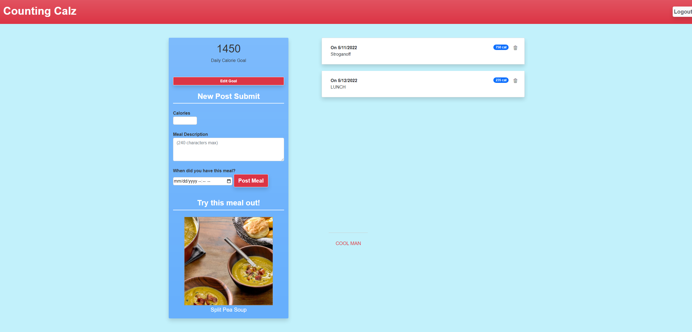

# 🍴 CountingCalz 🧮
>Your days are numbered, count your calories

CountingCalz is a tool for users to keep track of their calorie intake, and set daily calorie goals/limits. We also offer randomized meal suggestions with links to the recipe so you can broaden your nutrition horizons.

## 📃 Instructions
1. Head over to [CountingCalz](https://mysterious-spire-64686.herokuapp.com/)
2. Use the sign up form to create an account.
3. Set your daily calorie goal.
4. Use the New Post Submit section to add your meals and keep a record of all that you eat.

## 📸 Screenshot

## 🔨 Built With
- HTML
- CSS
- JavaScript
- [NodeJS](https://nodejs.org)
- [Express](https://www.npmjs.com/package/express)
- [Express-Session](https://www.npmjs.com/package/express-session)
- [Handlebars](https://www.npmjs.com/package/handlebars)
- [Sequelize](https://www.npmjs.com/package/sequelize)
- [TheMealDB](https://www.themealdb.com/api.php)

## ⚙ Contributers
*Made by*  
**[JacobReeder](https://github.com/JacobReeder)** 
**[cole22simpson](https://github.com/cole22simpson)** 
**[Tneswick](https://github.com/Tneswick)**
